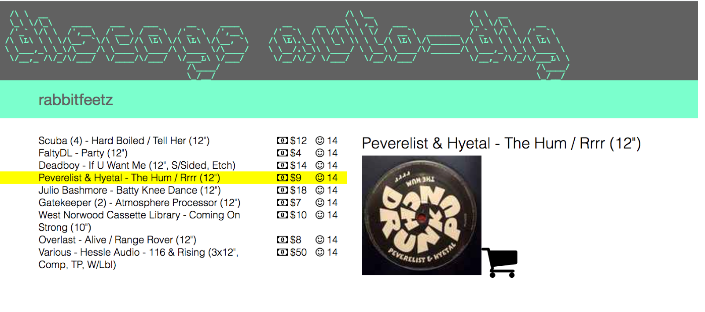

# Discogs Auto-Dig UI
This is the client-side React code for the Discogs Auto-Dig tool. This project aims to create a web ui that enables users to more easily find good\* music and buy used media on the Discogs.com marketplace.  This is currently a work in progress and not production-ready, but read the todo to see a list of features to come.

<sub>*\*What is good music is probably highly subjective but one idea is that records with a high number of "wants" might be more worth the user's attention.*</sub>

Here is a recent screenshot. (WIP)



### Requirements
- Node v7.0 +

This project is designed to be part of an AWS infrastructure but to run locally follow the instructions below.


### Install and Run

Create a `config.json` inside of `/src` that contains the following values:
```
{
  "API_KEY" : "<key>",
  "API_SECRET" : "<secret>",
  "RELEASES_URL" : "https://m8ljfebn0d.execute-api.us-east-1.amazonaws.com/production"
}
```
Install dependencies and run:
```
yarn install
yarn start
```

### Running Tests

Run tests with `yarn test`


## To Do
- [x] Retrieve a given seller's full inventory
- [x] Display listing artwork and link to purchase on discogs in media pane
- [x] Provide visual feedback for long requests (giant loading bar background behind logo)
- [ ] By default sort listings by a combined most wants and lowest price
- [ ] Display correct number of wants for listings in inventory
- [ ] Display price, record label, and full release info in media pane for a selected listing
- [ ] Display all youtube videos for a the selected listing in the media pane
- [ ] Hide youtube videos but allow playback control
- [ ] Add pagination of inventory listings
- [ ] Add genre filtering
- [ ] Cache full inventory requests for one day, either per-user or server side
- [ ] Display a breakdown of record labels in a seller's inventory
- [ ] Allow quick focusing of all records belonging to a particular label
- [ ] Introduce auto-playthrough feature where all listings are played through as a playlist one by one
- [ ] Deploy to discogsautodig.com production Website
